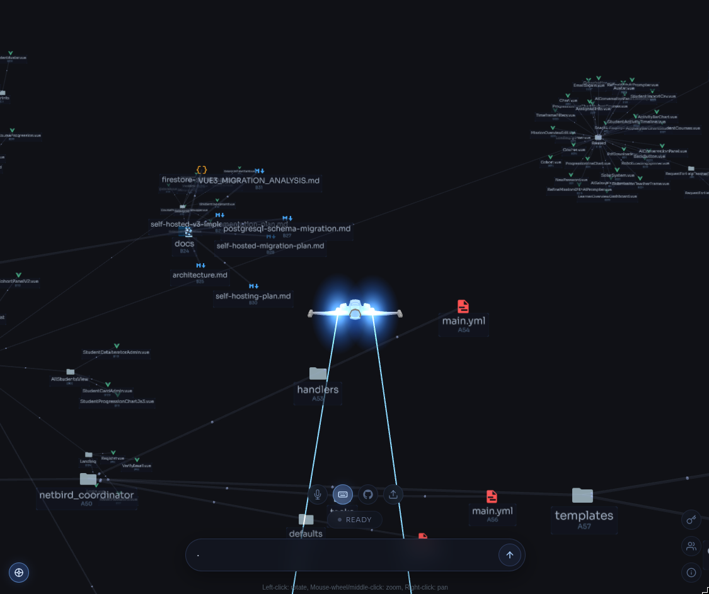
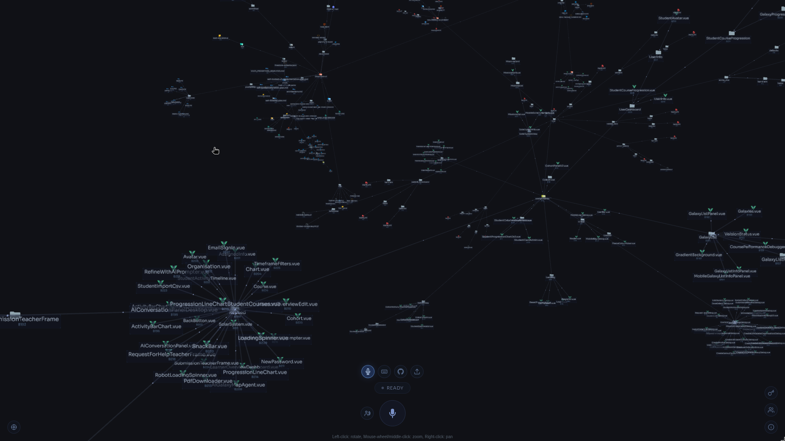

# graph-space

A collaborative graph workspace prototype. Speak, type, drop a markdown
file, paste a GitHub repo, or click an empty patch of canvas — every
input becomes nodes and edges in a live 3D knowledge graph anchored to
your avatar.

Offline-first. Each instance runs locally and persists to disk. Subtrees
sync peer-to-peer over **Gun.js** — publicly, end-to-end encrypted to a
specific recipient, or linked to your DID for anyone who has added you.




---

## What it does

- **Voice** — speak naturally; transcripts resolve into the graph via Claude
- **Text** — type to add concepts the same way
- **Markdown** — drop `.md` files to bulk-ingest documents
- **GitHub repo** — paste a URL to graph the file/folder structure as a DAG
  (deterministic, no LLM tokens; tiered cap with a "continue" toast)
- **Manual node** — click empty canvas to drop a node and pick its connections
- **Click-to-focus** — clicking any node makes it the parent for the next ingest
- **P2P sharing** — public spaces, encrypted shares, avatar-linked subtrees;
  remote nodes render in gold

---

## Architecture

```
       Browser (3D force graph + voice)
                    │
                    ▼
   ┌──────────── server.js ───────────┐
   │  /session         OpenAI session  │
   │  /ingest          resolver        │
   │  /ingest/node     manual add      │
   │  /ingest/github   repo ingest     │
   │  /ingest/keys     API keys        │
   │  /ingest/share    publish subtree │
   │  /ingest/peers    peer CRUD       │
   │  /ingest/events   SSE             │
   └──────┬─────────────────┬──────────┘
          │                 │
          ▼                 ▼
   pharos-store.js    gun-store.js
   in-mem + JSON      Gun graph + SEA DID
   (canonical)        (network sync)
                            │
                            ▼
                    Gun relay (deploy/gun-relay)
                            │
                            ▼
                       other instances
```

Two storage layers on purpose: a synchronous JSON file is the canonical
state (durable, fast, restart-safe). Gun mirrors every write so peers
can subscribe over a relay. Because Gun is offline-first, peers can
mutate while disconnected and converge when the relay is reachable again.

---

## Project layout

### Backend

| File | Role |
|---|---|
| `server.js` | Express endpoints + GitHub clone/walk |
| `pharos-resolver.js` | Anthropic SDK call (or OpenRouter fallback) with the ingest tool |
| `pharos-prompt.js` | System prompt + `pharos_ingest` tool schema |
| `pharos-store.js` | Canonical store (in-mem Maps + JSON file), Gun mirror, sharing API |
| `keys-store.js` | API keys: encrypted on Gun, cached locally |
| `gun-store.js` | Gun init, persistent SEA keypair, path helpers, remote event emitter |

### Frontend (`public/`)

| File | Role |
|---|---|
| `index.html` | Welcome overlay, mode row, mic, drop zone, modals |
| `style.css` | Dark cobalt UI; gold for shared/synthesized; predicate-coloured edges |
| `js/main.js` | Mode switching, ingest, focus tracking, panel handlers |
| `js/graph.js` | 3D force graph, node sprites, file-type icons, focus halo |
| `js/realtime.js` | WebRTC session with `gpt-realtime-mini` |
| `js/avatar.js`, `js/user.js` | Avatar + username persistence |

### Deploy (`deploy/`)

| File | Role |
|---|---|
| `Dockerfile.pharos` | Backend image |
| `gun-relay/` | Tiny Gun WebSocket relay container |
| `docker-compose.yml` | Local stack |

### Runtime data (`data/`, gitignored)

| File | Role |
|---|---|
| `data/identity.json` | SEA keypair → stable `did:gun:<pub>` |
| `data/keys.json` | API keys cache |
| `data/gun/` | Gun radisk store |
| `pharos-data.json` | Canonical local store |

---

## How an utterance becomes a node

1. `realtime.js` captures the transcript.
2. `main.js` POSTs to `/ingest` with `{ transcript, focusedParentId }`.
3. `pharos-resolver.js` calls Claude (Anthropic key direct, or via OpenRouter
   if only that key is set) using the `pharos_ingest` tool.
4. Per concept the resolver picks one outcome:
   - **new** → `addNode` + `assignCode` (`A1`-style code on a branch letter)
   - **related** → `addClaim` with a typed predicate (`EXPRESSES`,
     `EMERGES_FROM`, `OPERATIONALIZES`, `CONTRADICTS`, …)
   - **same** → `incrementExpression` on the existing node
   - **conflicting** → `addClaim` with `CONTRADICTS`; both endpoints get
     a red halo
5. Each node persists locally, mirrors to Gun, and renders in the graph.

`focusedParentId` (set by clicking a node) overrides any `parent_id: 'me'`
the resolver returns, so new concepts branch off whatever's focused.
Voice editing commands like `"move B4 to A2"` and `"remove C3"` flow the
same way and emerge as `operations` the frontend applies via
`graph.moveNode` / `removeNode`.

---

## P2P subtree sharing

Right-click any node:

| Mode | Where it goes | Who sees it |
|---|---|---|
| 🌐 **Make public** | `pharos>public>{spaceId}>graph` | anyone subscribed to the public index |
| 🔐 **Share with…** | `pharos>inbox>{recipientDID}>{spaceId}>graph` (encrypted) | the named recipient only |
| 🔗 **Link to my avatar** | `pharos>users>{yourDID}>shared` | every peer who has added your DID |

A DID (`did:gun:<pub>`) is generated from a SEA keypair on first run.
Open the share panel to copy yours; paste a peer's DID to subscribe to
their avatar-shared subtree. Encrypted shares use
`SEA.secret(theirDID, ourPair)` to derive a symmetric key both peers
compute without exchanging it. The relay does no auth — confidentiality
lives in SEA encryption.

---

## API keys

Click the key icon (top of the right edge) to enter:

- **OpenAI** — required for the realtime voice model
- **Anthropic** — used by the resolver for every ingest
- **OpenRouter** — fallback for ingest when no Anthropic key is set

Keys are stored encrypted on Gun under your DID (so they survive restarts)
and cached in `data/keys.json`. Env vars (`OPENAI_API_KEY`,
`ANTHROPIC_API_KEY`, `OPENROUTER_API_KEY`) are a last-resort fallback.

---

## Endpoints

| Method | Path | Purpose |
|---|---|---|
| `POST` | `/session` | OpenAI Realtime ephemeral client secret |
| `POST` | `/ingest` | Resolve transcript |
| `POST` | `/ingest/node` | Manually create a node + connections |
| `POST` | `/ingest/github` | Clone a repo, graph its file/folder DAG |
| `DELETE` | `/ingest/node/:id` | Remove a node + subtree |
| `GET` | `/ingest/state` | Current store snapshot |
| `GET` | `/ingest/identity` | This instance's DID |
| `GET` / `POST` | `/ingest/keys` | Get masked / save API keys |
| `POST` | `/ingest/share` | Publish a subtree (`public` / `specific` / `avatar`) |
| `DELETE` | `/ingest/share/:spaceId` | Tombstone a public share |
| `GET` / `POST` / `DELETE` | `/ingest/peers[/:did]` | Peer CRUD |
| `GET` | `/ingest/events` | SSE stream of remote shared nodes/claims |

---

## Environment

```
OPENAI_API_KEY=sk-...                # optional if entered in UI
ANTHROPIC_API_KEY=sk-ant-...         # optional if entered in UI
OPENROUTER_API_KEY=sk-or-...         # optional fallback
PORT=3002                            # default port
GUN_RELAY_URL=https://experiments.sunriselabs.io/gun  # shared relay; empty = offline
RESOLVE_MODEL=claude-sonnet-4-6      # optional override
```

---

## Quick start

Requires Node ≥18 and `git` on PATH (for repo ingest).

```bash
git clone https://github.com/tairea/graph-space.git
cd graph-space
npm install
cp .env.example .env  # optional — keys can also be entered in the UI
npm start
```

Open http://localhost:3002, enter your name, optionally upload an avatar,
paste your API keys via the key icon, then start talking / typing /
dropping files / pasting repo URLs.

To run **fully offline** (no P2P sharing) set `GUN_RELAY_URL=` (empty).
To **self-host the relay**, run `cd deploy/gun-relay && npm install &&
node relay.js` in another terminal and set
`GUN_RELAY_URL=http://localhost:8765/gun`.

---

## Live deployment

The live instance runs under PM2:

```bash
pm2 list
# graph-space   ← node server.js              (port 3002)
# gun-relay     ← deploy/gun-relay/relay.js   (port 8765)
```

Front-ended by nginx at https://experiments.sunriselabs.io/graph-space/
with `proxy_buffering off` for the SSE stream. Restart with
`pm2 restart graph-space --update-env` after changing `.env`.
